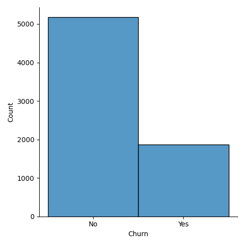
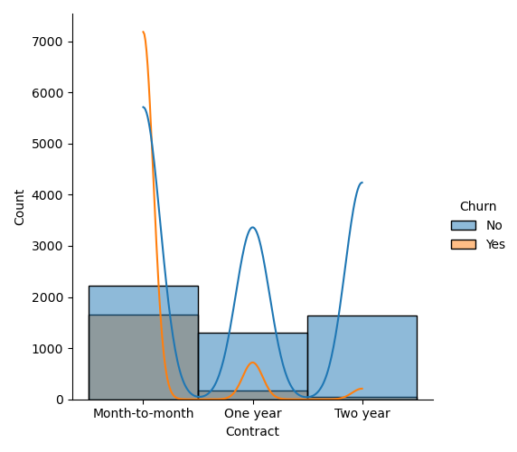
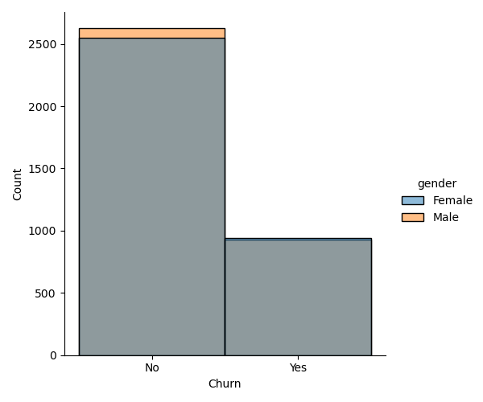
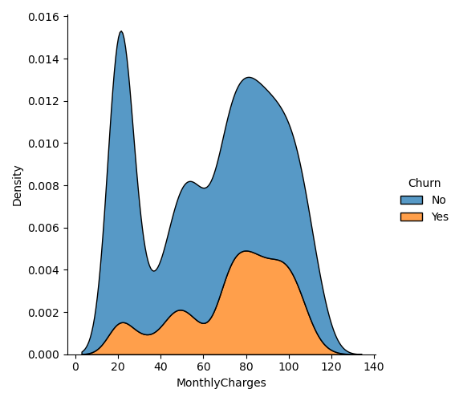

# Customer Churn Prediction

An end-to-end **customer churn prediction product** for telecom businesses. The application takes customer and service information, predicts the likelihood of churn using a trained machine-learning pipeline, and presents the result through a simple web interface.

The goal is to turn a churn model into something a **retail/telecom employee could actually use** when assessing a customer.

## What it does

- Collects customer, service, contract, and billing information through a web form.
- Uses a trained **Logistic Regression** pipeline for churn prediction.
- Returns both the predicted class and **churn probability**.
- Converts probability into a simple **Low / Medium / High risk** view.
- Provides a basic retention-oriented recommendation for higher-risk customers.
- Exposes the model through a **FastAPI REST API**.
- Provides interactive API testing through FastAPI Swagger docs.
- Keeps the complete ML workflow in a notebook, from EDA to model selection and tuning.

## Product Flow

```text
Customer details
      ↓
Web Frontend
      ↓
FastAPI /predict
      ↓
Saved ML Pipeline
      ↓
Churn prediction + probability
      ↓
Risk level + retention guidance
```

## Model

Multiple classification models were evaluated, including:

- Logistic Regression
- K-Nearest Neighbors
- Decision Tree
- Random Forest
- XGBoost

Logistic Regression gave the strongest initial F1 score and was subsequently tuned with `GridSearchCV`. Because missing a potential churner can be costly in a retention setting, **recall** was given particular importance during tuning.

The final fitted preprocessing + model pipeline is saved in:

```text
pipeline/pipeline_churn.pkl
```

## Application

```text
churn/
├── app/
│   └── main.py
├── dataset/
│   └── Telco-Customer-Churn.csv
├── frontend/
│   ├── index.html
│   ├── script.js
│   └── style.css
├── images/
│   ├── churn_count.png
│   ├── churn_count_wrt_duration.png
│   ├── churn_count_wrt_gender.png
│   └── churn_count_wrt_monthly_charges.png
├── notebook/
├── pipeline/
│   └── pipeline_churn.pkl
├── .gitignore
├── README.md
└── requirements.txt
```

## Insights

### Overall Churn



### Churn by Tenure



### Churn by Gender



### Churn by Monthly Charges



## Tech Stack

**Machine Learning:** Python, Pandas, NumPy, Scikit-learn, XGBoost, Joblib

**Backend:** FastAPI, Pydantic, Uvicorn

**Frontend:** HTML, CSS, JavaScript

**Development:** Git, GitHub, VS Code

## Run Locally

Install dependencies:

```bash
python -m pip install -r requirements.txt
```

Start the API:

```bash
python -m uvicorn app.main:app --reload
```

Open the application:

```text
http://127.0.0.1:8000/frontend/
```

API documentation:

```text
http://127.0.0.1:8000/docs
```

## Roadmap

- [x] EDA and feature analysis
- [x] Model comparison
- [x] Model tuning
- [x] Saved ML pipeline
- [x] FastAPI backend
- [x] Web frontend
- [x] Git/GitHub version control
- [x] Dockerize the application
- [x] Deploy the application
- [x] Improve retention recommendations
- [x] Add model explainability

## Author

**Aman Kumar**

Electronics & Communication Engineering  
Machine Learning • Data Science • Backend
